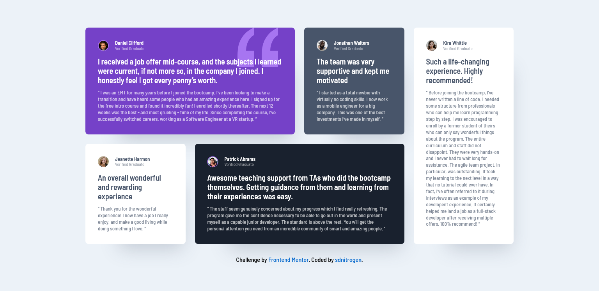

# Frontend Mentor - Testimonials grid section solution

This is a solution to the [Testimonials grid section challenge on Frontend Mentor](https://www.frontendmentor.io/challenges/testimonials-grid-section-Nnw6J7Un7).

## Table of contents

-   [Overview](#overview)
    -   [The challenge](#the-challenge)
    -   [Screenshot](#screenshot)
    -   [Links](#links)
-   [My process](#my-process)
    -   [Built with](#built-with)
    -   [What I learned](#what-i-learned)
    -   [Continued development](#continued-development)
    -   [Useful resources](#useful-resources)
-   [Author](#author)
-   [Acknowledgments](#acknowledgments)

**Note: Delete this note and update the table of contents based on what sections you keep.**

## Overview

### The challenge

To build out the testimonials grid section of a bootcamp website and get it looking as close to the design as possible.
Users should be able to:

-   View the optimal layout for the site depending on their device's screen size

### Screenshot

### Links

-   Solution URL: [https://t.co/hwCEA4ETA0](https://t.co/hwCEA4ETA0)
-   Live Site URL: [https://testimonials-grid-section-sdnitrogen.vercel.app/](https://testimonials-grid-section-sdnitrogen.vercel.app/)

## My process

### Built with

-   Semantic HTML5 markup
-   CSS custom properties
-   CSS Grid
-   Mobile-first workflow

### What I learned

Used CSS Grid for the body as well the testimonial section and placed each testimonial articles in their specific grids according to the responsive layouts. I didn't use grid-template-areas for this solution but that is another fun way to implement grids for responsive layouts which I'll explore in the upcoming challenges.

### Continued development

I'd continue to polish my css grid skills along with css flexbox for designing the perfect layouts.

### Useful resources

-   [CSS Tricks](https://css-tricks.com/) - This website always comes in clutch when you need to lookup specific css functionalities.

## Author

-   Website - [sdnitrogen](https://sdnitrogen.github.io)
-   Frontend Mentor - [@sdnitrogen](https://www.frontendmentor.io/profile/sdnitrogen)
-   Hashnode - [Nitro Blog](https://sdnitrogen.hashnode.dev/)

## Acknowledgments

I've included a CSS Grid cheat-sheet that I always refer to when I'm stuck and I'd love to mention the original creator here - [@simonpaix](https://twitter.com/simonpaix).
